use the Sales2017_raw.csv

- Load the data

- transform data 

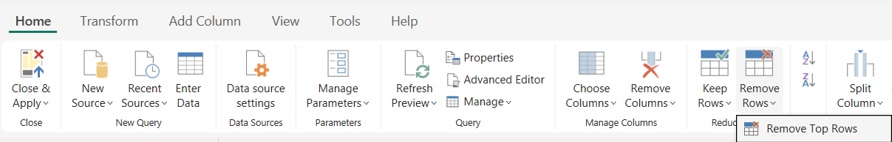

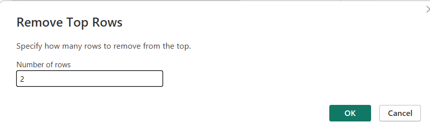

Now first 2 rows got deleted

> 💡 **Tip:** You can undo steps from the *Applied Steps* pane.

- Reconfigure the Settings using gear icon
Now if you want you can change the number of rows

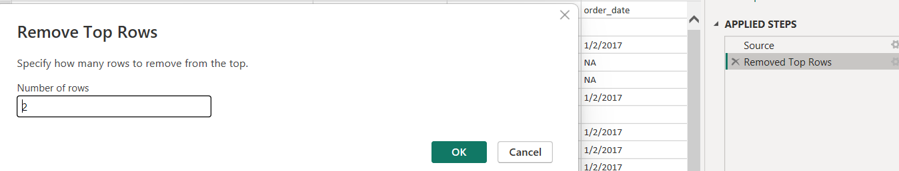

- Look into 1st row closely .Actually it is header not a data

to change the column Header

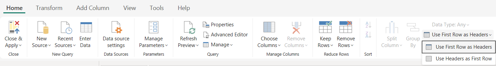

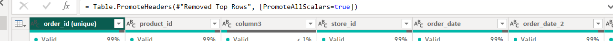

close and Apply.

---

### How to Fix Data Source Errors in Power BI: Troubleshooting Missing File Paths

suppose after loaded the data into power bi if you move source(datasheet) to some other file path. You will be getting an error.

To avoid that error

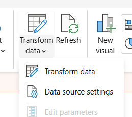

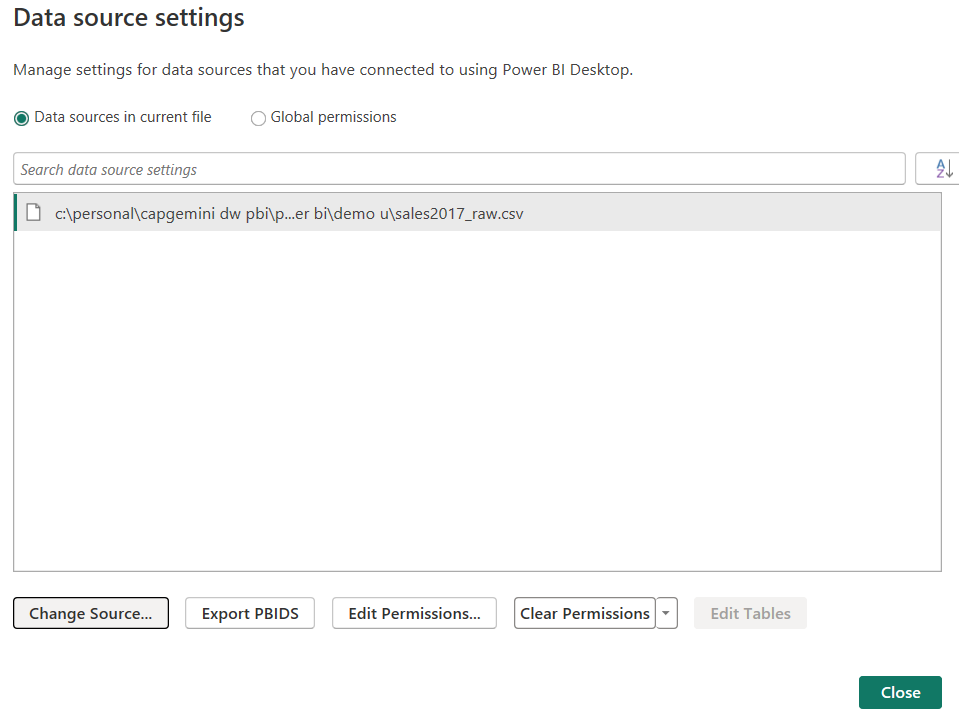

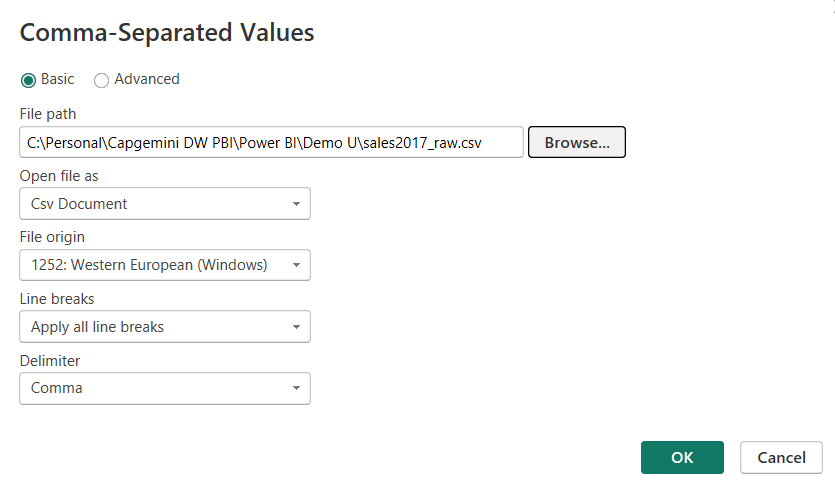

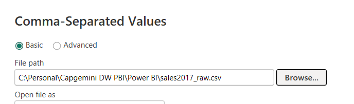

Now error will go off

---

### Power BI Data Transformation: Using Remove Rows and Choose Columns Features

#
---

### Remove Blank Rows

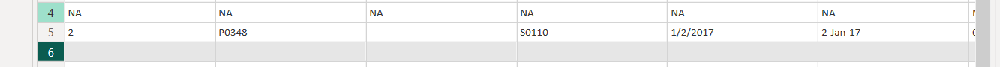

Here we have some blank rows  which is not good .so let us remomve it

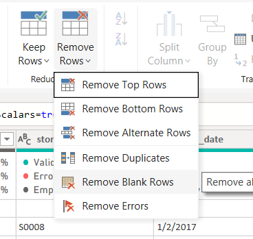

Here 

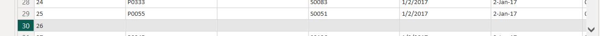

 in row 30 looks like blank row but it was not removed.reason behing Order_id column has the value.

 
---

### Filter Rows 

 in product_id column
 
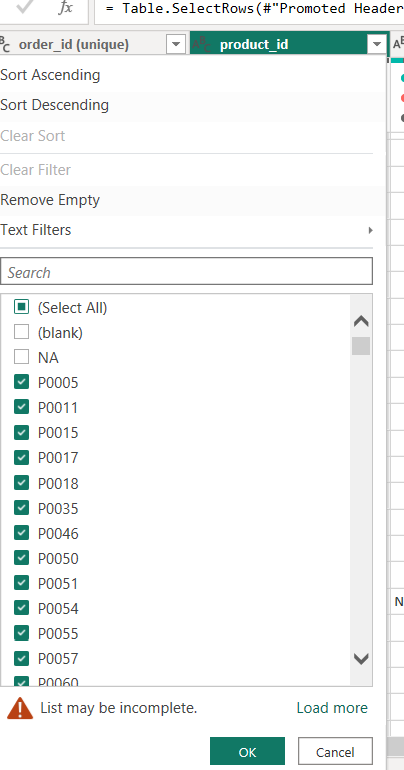

 
---

### Remove Duplicates

 
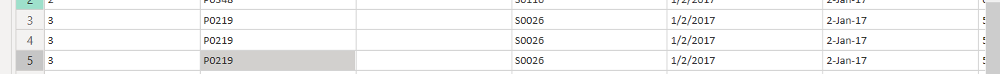

 select the Column (order_id) Remove Rows -> Remove Duplicates

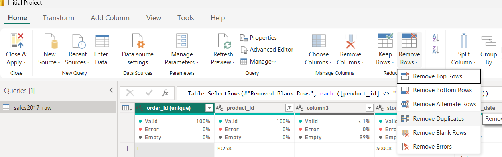

Here sales column also have duplicates. if apply remove duplicates . It will behave differently according to the filter we applied

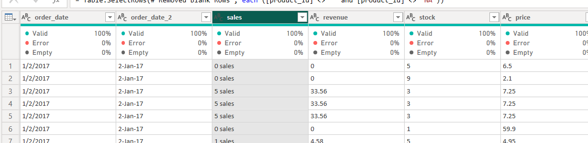

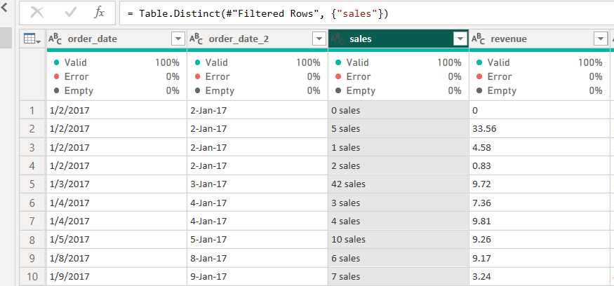

---

### Remove Columns

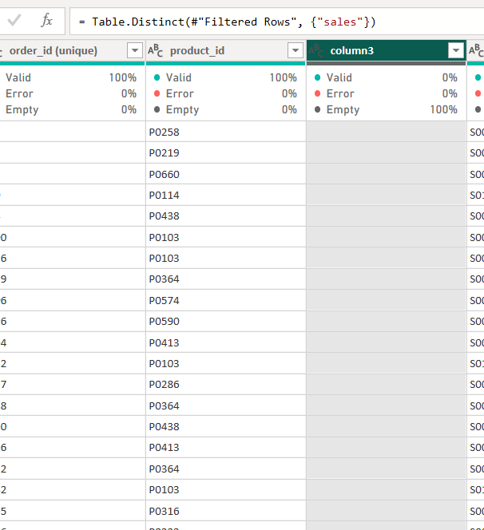

Remove other columns also helpful in sometimes

#
---

### choose Columns

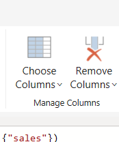

Now column3 Removed

---

### Power BI Query Editor: Changing Column Data Types for Accurate Analysis

Add a new visual

y value -> Revenue

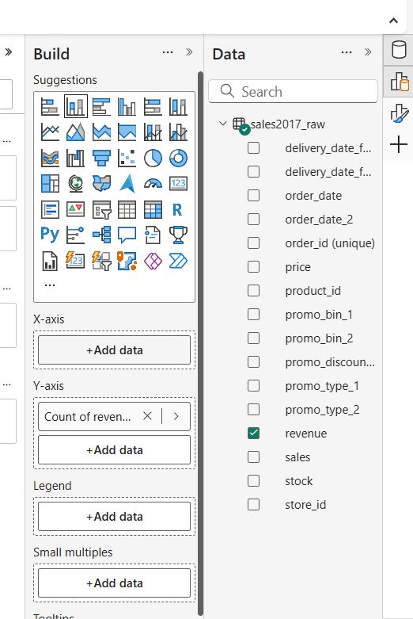

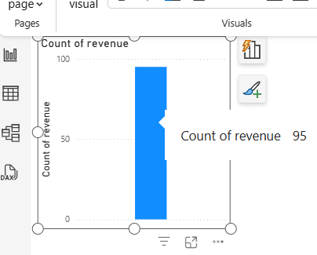

as it is a text type under summerization we are not getting sum,Average,...

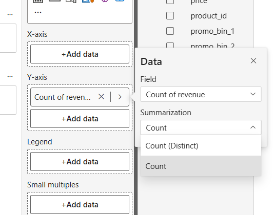

Actually Revenue is not a number. Let us change the datatype for revenue column-> transform data

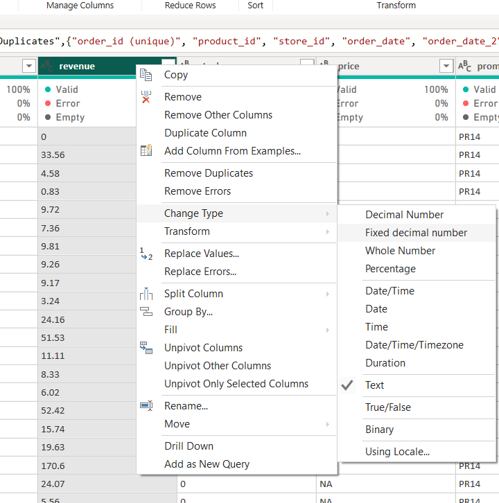

change type -> Fixed Decimal number ->

Go back to -> desktop -> and check y value shows aggregation fields.

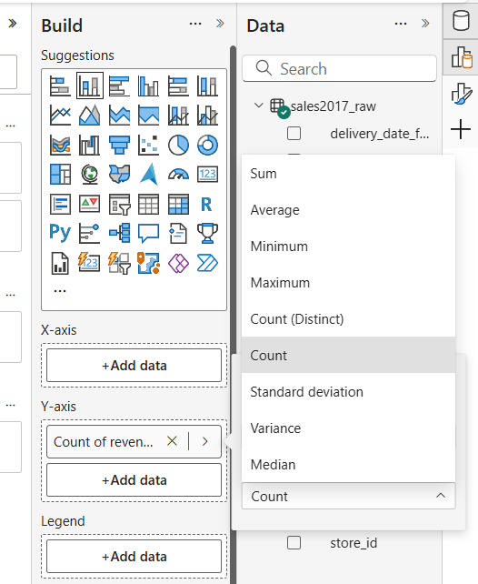

Select the revenue column in desktop model(data pane)

column  tools

check the datatype -> if  you want to change the currency you can change it.

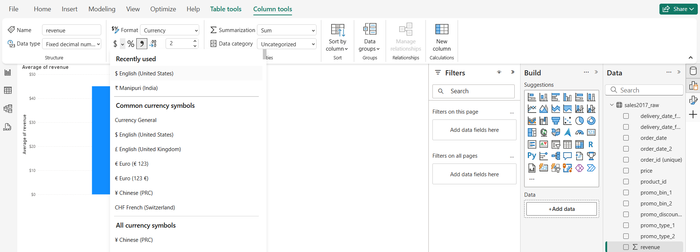

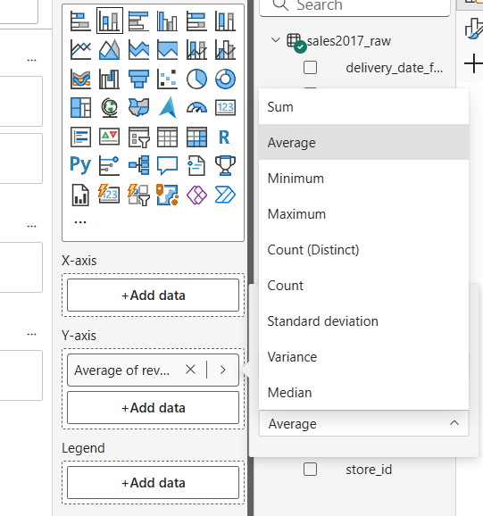

Rename the column order_id (unique) -> order_id

order_date, order_date2

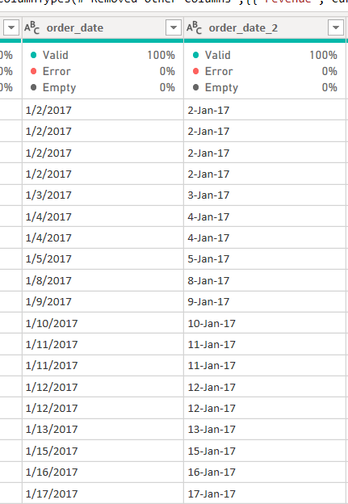

it shows date  in different format
Now let us change the datatype for both the column as date

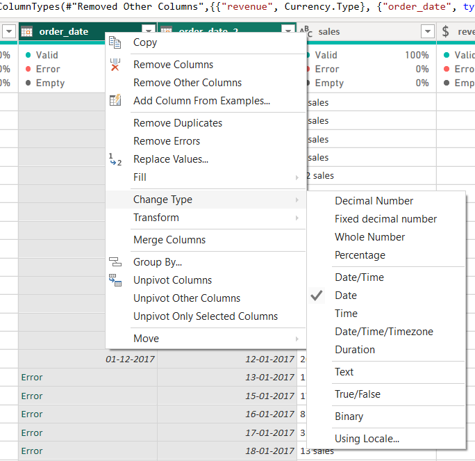

after changing the datatype for both the column now format looks like same.
Before changing the datatype it shows in different format

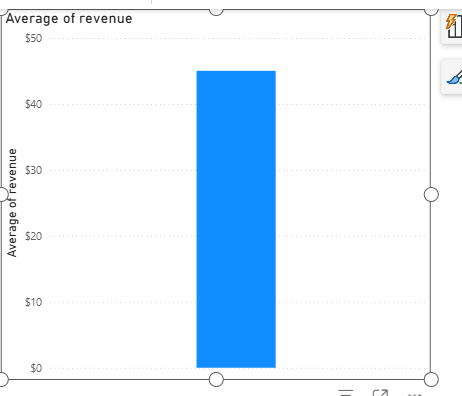

now you drag order_date to your visuals(column(or) bar chart).Now it shows the year-> Drill down -> Quarter-> drill down -> Month,..

We need to change the delivery_date,delivery_date2 to date

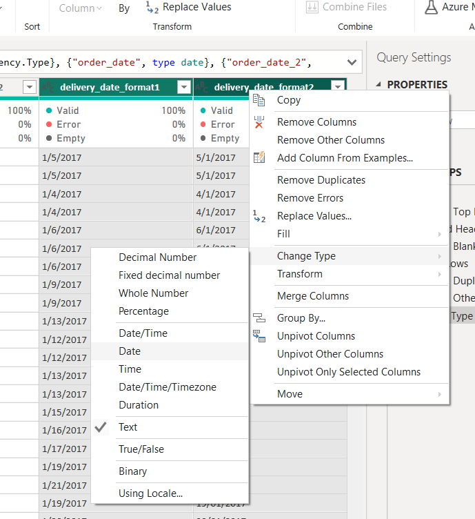

if you get some error (Change type -> use Locale) ->Select Appropriate Date format

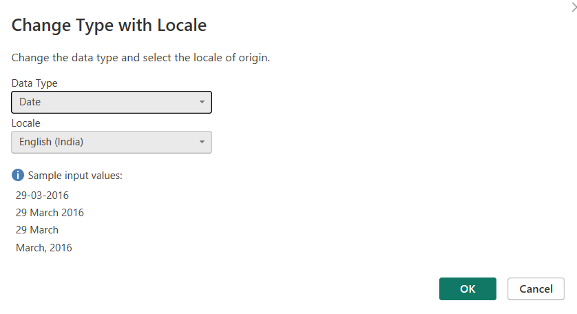

To check all column datatype are proper -> Query editor ->Transform ->Detect Datatype

Price -> ABC -> Actually it would number or decimal number

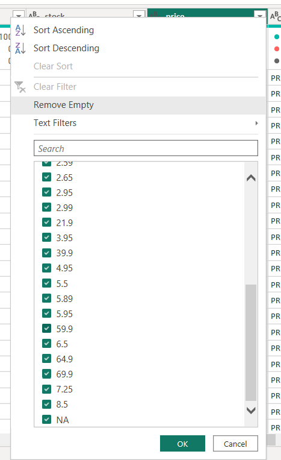

As it contain NA it considered as ABC(text) -> Filter the Rows without NA (uncheck the NA) ->  Detect Datatype -> Now it considered as Decimal number

---

### Replace Values

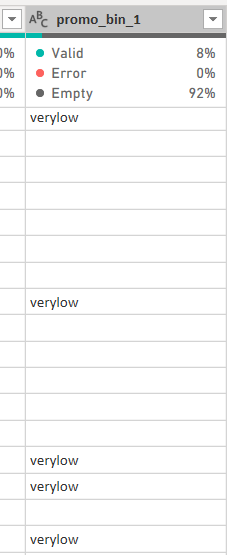

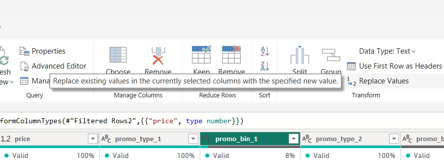

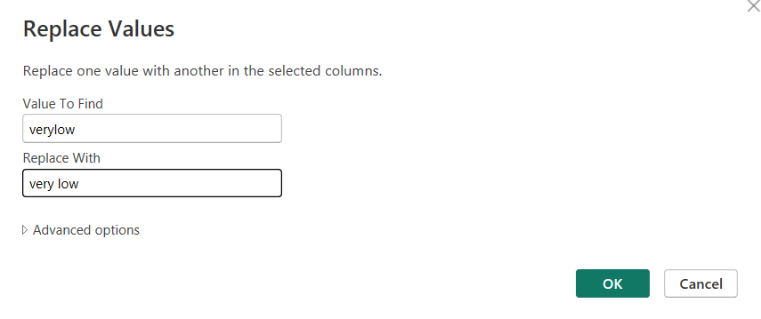

sales column 

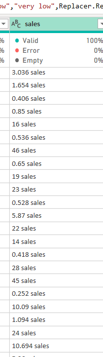

data contains sales .so we can't perfomr the aggreagation later. So let us try to change the datatype as Decimal Number ->We will get an Error

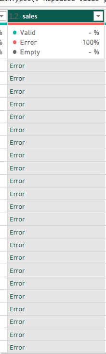

Then remove the previous applied steps to getrid of the error

Select the Column ->Replace values ->

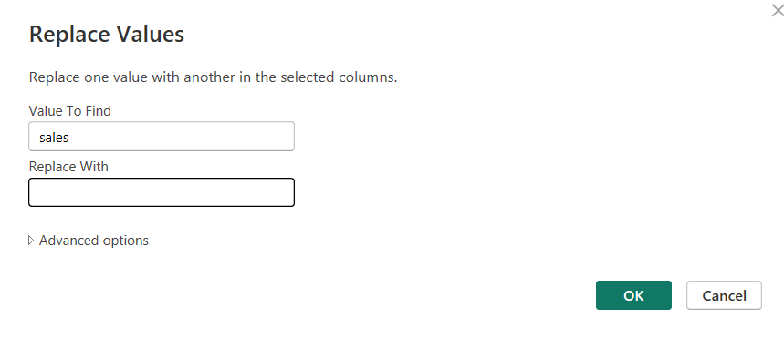

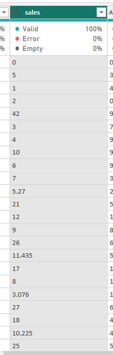

Now you can change the datatype to decimal number

