---

## Effective Visualizations and Data Transformations

---

## How to Extract Values in Power BI: Data Transformation Techniques for Analysis

Store_cities.csv

You can load the data in same file(day1 excecise).

Rename the Query in Query editior
sales2017_raw -> sales2017
stores_cities -> stores

- Sales table has store_id

- stores table has store_id

Let us give a relationship b/w them

- Use First row as header in stores

Have a look into Store_size,State column. We need to extract only state name from state column, number from store_size

- let us rename steore_size -> store size

- select the store size -> transform Ribbon  -> Extract

- 
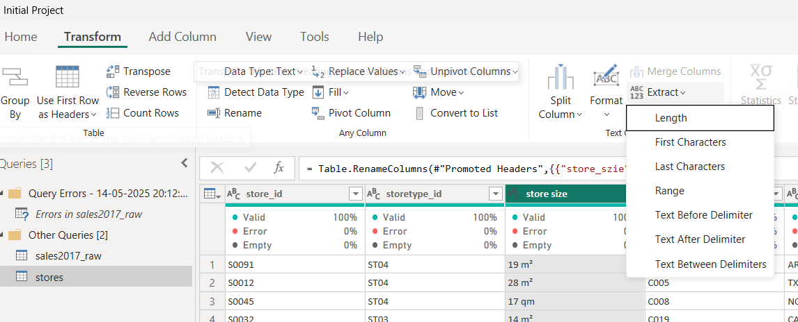

- choose text before delimeter

- 

- ok

- 

- Goto store column

- 

- Text Between Delimeters

- 

- start delimeter -> space-space

- end delimeter -> space-space

- 
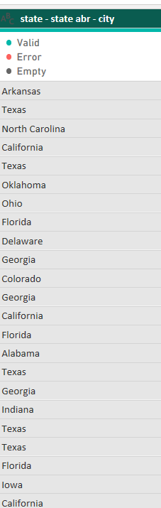

- Here we lost city name and other details

- > 💡 **Tip:** Remove the applied steps if not needed.

- option1 -> Duplicate the column -> Extract according how you need

- option 2 -> Split Column ->by delimeter

- to do the split -> select state column->Home Ribbon -> split column

- 
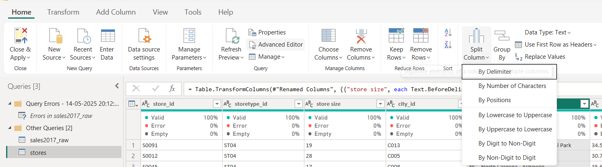

- by delimeter

- 
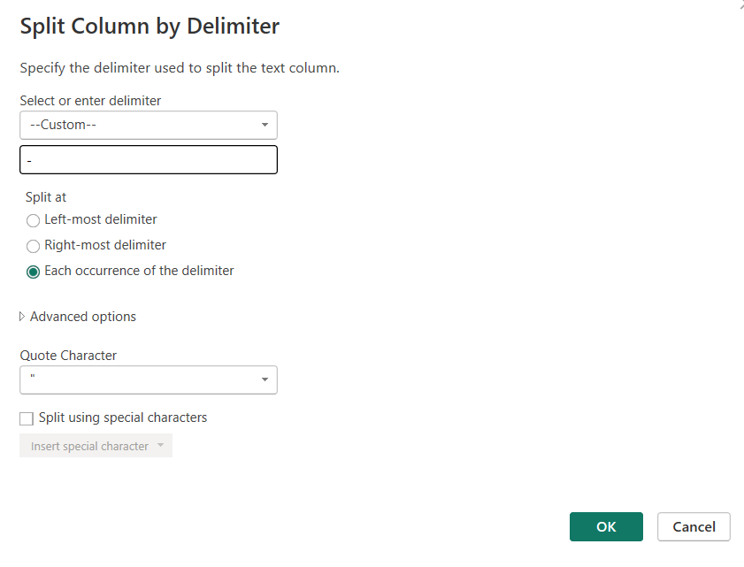

- 
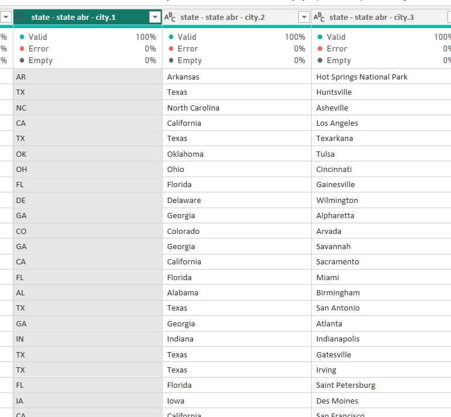

- Rename the column like below

- 
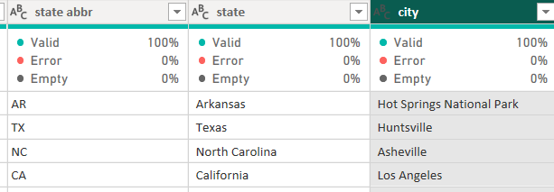

- Let us do the same step for lat/long colunm as well

- 
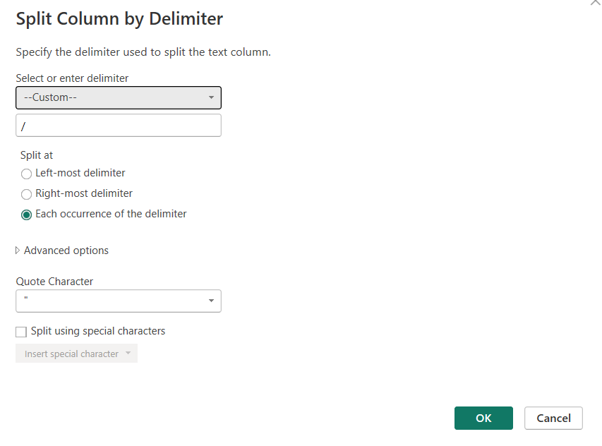

- 

- # Split column by Position

- select the state column ->split column position -> 0,3 ,6

- 

- we can split in this way as well. But **this is not necessary case for us**.Let us remove the applied steps

- select all the columns and detect datatype -> from tranformm ribbon
  
  

---

## How to Clean and Transform Text Data in Power BI Query Editor

- Let us Remove the leading and trailing white space using Trim

- select the column (state) 

- option 1 -> Tranform Ribbon -> Format

- 

- option 2 -> Right click on the column ->Transform -> Trim

#### Let us understand the difference between Trim and Clean
 in power query editor -> new source -> text/csv ->ProductHierarchy.csv
  
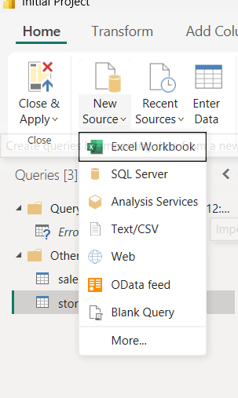

  

- First Row as Headers

- Look into Product column which has some tab,... (it is called control characters)

- 
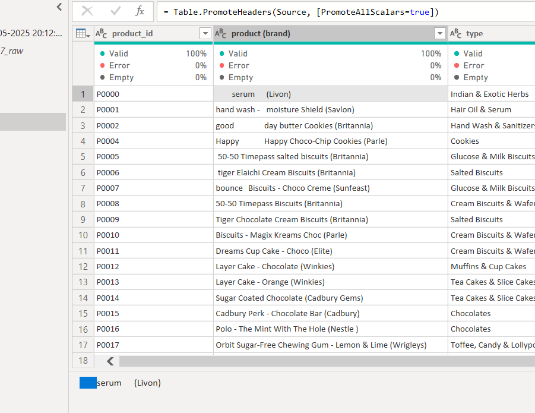

- it is not leading white space it is tab (control chars)

- to remove it we use Clean

- 

- clean

- 
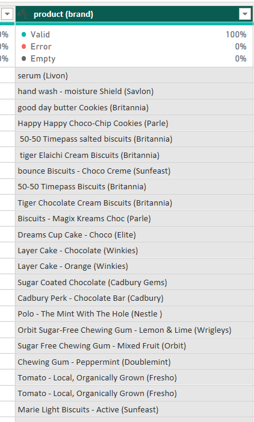

- Capitalize Each word in product column

- 
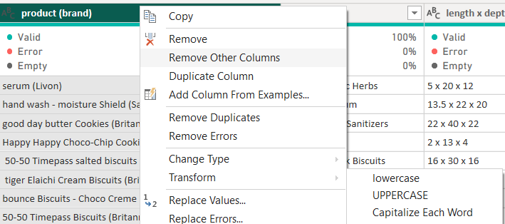

- split the length*depth*width using split column -> by delimeters

- 
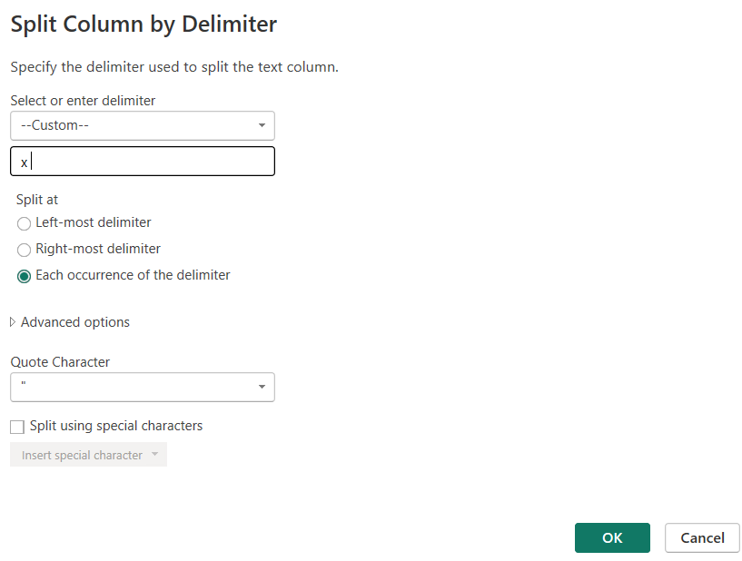

- 
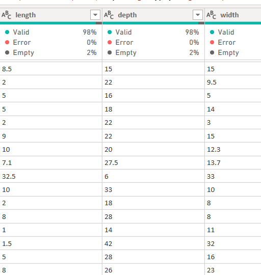

- same do for category and sub-category column as well

- select Category and subcategory -> Right click -> Split column -> By delimeter

- 
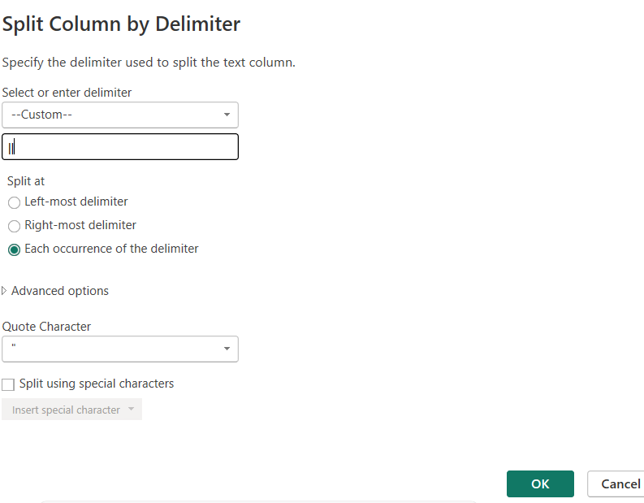

- rename column

- 
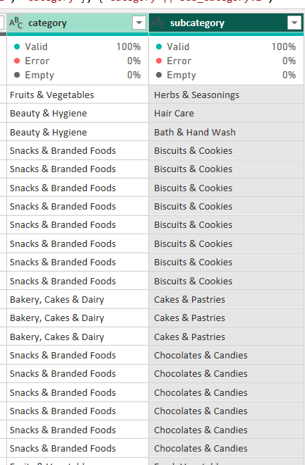

- change the datatype for length depth and width column to whole number

- 

---

## Power Query Data Cleaning: Numerical Transformations in Power BI

- In last step we changed this whole number . If we have some decimal values will get round off.

- but if we need to calculate real data we need exact number

- change datatype -> decimal number 

- you need to select Replace current -> if not changing the whole number -> decimal  -> we wont get actual previous values

- If the selected column is numeric -> in transform Ribbon standard option will enabled

- Add

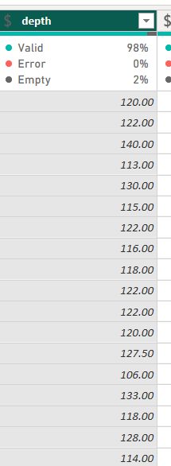

- Now it's not needed  -> remove the applied steps

- just assume length is there in cm -> if you want to convert to inches -> Standard ->Multiply -> 0.394 

- but inches not needed now -> REmove the applied steps

- 

- How many sales happened in each category.So data from ProductHierarchy,Sales,Stores .For that we need to work on data Model

---

## Power BI Data Model Essentials: Building Efficient Relationships for Dashboards(22)

- close and apply in power query Editor

- report view

- place stacked column chart

- x axis -> category from product hierarchy

- y axis ->revenue from Sales

- 
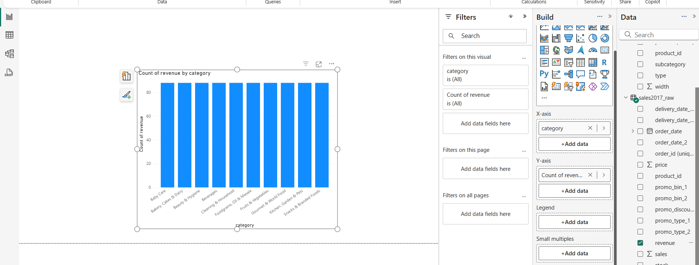

- The image shows same value for all column. It means there is no relationship between ProductHierarchy and sales model.

- Goto Model view -> Drag product_id from sales to ProductHierarchy (or) otherway around to give a relationship between the models 

- 
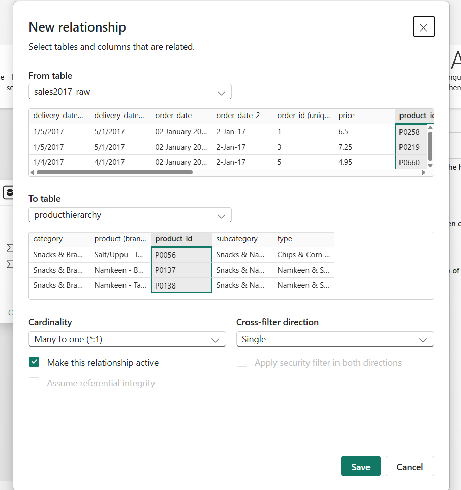

- 
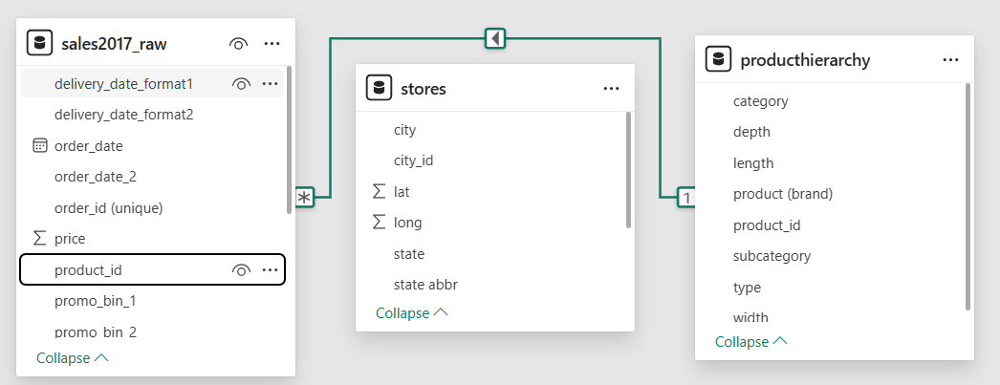

- goback Report view and check the Chart 

- 
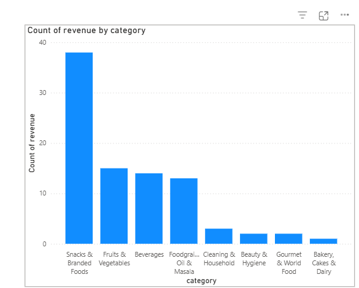

---

## Practice: Data Cleaning & Relationship

This is a quick exercise to practice what we've learned so far.
Do what is needed to find out the answers to the following questions:

- What is the total revenue in California?

- How many sales has the product "Namkeen 
- Rice Kodubale (Sln  )"?

- What is the average price in Dallas?

Resources for this lecture
PracticeDay2.zip

---

## Power BI Visualization Techniques: Mastering Stacked Column Charts and Legends

stacked column chart 
x-axis -> category
y-axis -> Sum of Revenue

legend ->promotype from sales

small multiples ->city

Remove legend

---

##  Mastering the Format Pane for Enhanced Visualizations (28)

---

## How to Use Pie Charts Effectively in Power BI: Best Practices and Alternatives(29)

Rules

- Pie charts are hard to compare the values

- don't compare two pie chart 

- Use Pie chart to display % or Total

- Pie chart is ideal for 2-3 categories Max (5) categories

- place pie chart ->Legend (state) ->values (revenue)  ->Options (Percentage,Category,...)

- Details ->City

---

## Assignment: Final Project: Day 2

Day 2: Final Project
In this assignment, you can again use your own project file ( your own solution from yesterday) from your previous work in yesterday's final project for the day.

Alternatively, you can also just use the project file (see "Downloadable resources" below) 
- you just need to change the data source settings again.

Questions for today:

What Education group has bought on average most fish products?

What Education group has bought on average most meat products?

What Education group makes up for most fish product sales in total?

What Education group makes up for most meat product sales in total?

Instructions:

1. Open the attached Power BI .pbix file or use your own Power BI file/your own solution from yesterday's final project of the day (just make sure to

use the same settings as we did in the course).

2. There is an additional data file in the resources called "marketing_sales_data.csv". Also, get this data connected to your project file.

3. Clean the data so that you can answer the questions above. Use the tools /

steps:

o Connect the file to Power BI

o Remove Top Rows

o First row as a header

o Changing column names (if needed)

o Removing invalid rows (if needed)

o Setting up the data types

o Create a data model

I want to leave the exact steps and order of steps to you as a practice! Afterwards, there will be also a detailed solution! So just try if you can make the right transformations/connection in the data model if necessary to answer the above questions.

4. Visualize the data so that the answer can be presented by the Marketing Department with a little report.

Cheers,
Geetha

Questions for this assignment
What Education group has bought on average most fish products?